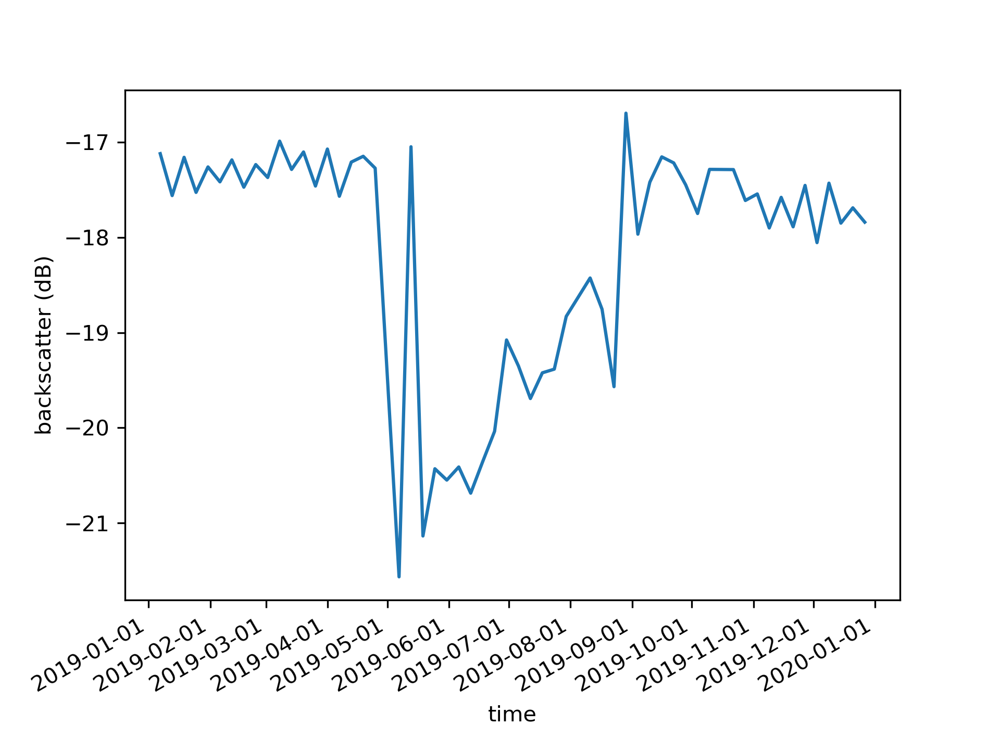

### melt_lake_datacube

How to detect melt lakes on ice sheets using STACs 

The `melt_lake_sample_tutorial.ipynb` in the `melt_lake_datacube` shows how to sample melt lakes using [Microsoft Planetary Computer's Sentinel 1 Radiometrically Terrain Corrected (RTC)](https://planetarycomputer.microsoft.com/dataset/sentinel-1-rtc) catalog. `melt_lake_detection_s1_rtc_ec2.py` is the scipt I ran on my ec2 instance and saved the resulting xarray dataset as a csv s`urface_CW2019_lake_mean_da_asc_hv.csv` in the `output` directory. The `read_csv_from_flox.ipynb` is the code I wrote to plot the time series plots. Those plots are also in the `output` directory. See example from a single lake below 



## Installation
Below are instructions for installation with a UNIX terminal. This is tested on my ubuntu 22.04 system.

To use this repo first clone the repository and change to the directory where the repo is located
```
git clone https://github.com/shahinmg/melt_lake_datacube.git
```
```
cd melt_lake_datacube
```

Within the `melt_lake_datacube` directory, install the packages in the `environment.yml` in a conda environment or create a new environment and install with `conda env create --file environment.yml` and activate the environment  

Note: This can take a long time to create the environment

```
conda env create --file environment.yml
```

```
conda activate melt_lake_datacube
```

Note: I created this yml using `conda env export > environment.yml`. Sometimes I have issues with that when I create other environments from someone else's repo. If you have conflicts from this yml, let me know and/or make an issue or pull request. 

## Thoughts on improvements 
I tried to make a GPU native version using cupy-xarray `cupy_xarray_test.ipynb`, which is not working as of now. We should also try to speed things up for when we scale up. Some thoughts might be to use the `cohorts` method in the group by. More on that is [here](https://flox.readthedocs.io/en/latest/user-stories/climatology.html). 

We also need to verify some lakes with optical imagery to see what is actually hapening in the visible spectrum as well. 